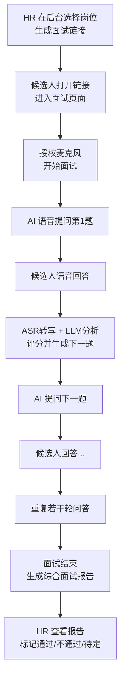

# AI 语音面试系统（HR 初筛版）需求分析 v0.1

## 1. 项目背景与目标

### 1.1 背景

- 公司招聘岗位较多，HR 初筛成本高、标准不统一，依赖人工经验。
- 项目经理、产品经理、销售等岗位，对沟通表达、思维逻辑、过往经验要求高，传统问卷/简历筛选难以有效评估。
- AI 大模型 + 语音交互技术已经可以完成较自然的“半结构化面试”，适合作为 HR 的初筛工具。

### 1.2 目标（MVP 版本）

1. 搭建一个 **AI 语音面试系统（Web）**，供 HR 发起、查看和管理面试。
2. 实现 AI 面试官与候选人进行 **语音问答式对话**，围绕：
   - 自我介绍
   - 典型项目/产品/销售经历
   - 基础能力：沟通表达、逻辑思维、职业动机与稳定性
3. 面试结束后，自动生成 **结构化面试报告**，用于 HR 初筛决策：
   - 维度评分
   - 优势与风险点
   - 是否建议进入下一轮

---

## 2. 用户与角色

### 2.1 角色列表

1. **HR 用户**
   - 系统主要使用者。
   - 职责：
     - 创建岗位。
     - 使用系统预置面试模板。
     - 生成 AI 面试链接并发送给候选人。
     - 查看候选人面试记录与 AI 评估报告。
     - 标记“通过 / 不通过 / 待定”等初筛结论。

2. **候选人（无需系统账号）**
   - 通过 HR 提供的链接进入面试页面。
   - 在 Web 页中授权麦克风，使用语音回答 AI 的问题。
   - 面试结束后可选：看到简要反馈（是否展示可配置）。

3. **系统管理员（可与 HR 合并角色，MVP 可简化）**
   - 管理基础配置（职位能力模型库、系统参数）。
   - 查看系统使用情况和日志。

---

## 3. 使用场景与典型流程

### 3.1 典型场景：HR 邀约候选人进行 AI 初筛

1. HR 在系统中选择岗位（项目经理 / 产品经理 / 销售）。
2. 点击“生成面试链接”，将链接发给候选人（邮件 / 微信等）。
3. 候选人在 PC 浏览器打开链接，进入 **AI 语音面试页面**：
   - 授权麦克风。
   - 阅读注意事项，点击“开始面试”。
4. AI 通过语音向候选人提问（单轮一问一答）：
   - 自我介绍。
   - 项目/产品/销售相关问题。
   - 深挖细节问题等。
5. 候选人逐题语音回答。
6. 面试结束后，系统生成 **面试报告**：
   - 评分 + 评语 + 建议。
7. HR 在后台查看该候选人的面试报告及录音/转写文本，做初筛决策。

### 3.2 简化流程图（Mermaid）

---

## 4. 功能需求

### 4.1 账号与权限（MVP 简化）

> 目标：只支持公司内部 HR 登录使用；候选人通过链接免登录进入。

- HR 账号登录：
  - 支持公司内部已有账号体系 / 简单账号密码登录（二选一，MVP 可先用本系统账号）。
- 权限控制：
  - MVP：所有 HR 权限相同（查看所有岗位和候选人）。
  - 后续升级：按部门/岗位做权限隔离。

> 候选人端：
> - 通过面试链接访问，无需注册/登录。
> - 链接包含会话 token，用于绑定“候选人 + 岗位 + 面试场次”。

---

### 4.2 岗位与面试模板管理

> 面向 HR，用于定义不同岗位的面试逻辑与能力模型。

#### 4.2.1 岗位管理

- 功能点：
  - 新增招聘岗位：
    - 岗位名称（项目经理 / 产品经理 / 销售）。
    - 岗位编码。
    - 简要岗位说明（Job Description）。
  - 启用/停用岗位（停用岗位不再生成新面试链接）。

- MVP：预置三个岗位模板，由系统管理员初始化：
  - 项目经理。
  - 产品经理。
  - 销售人员。

#### 4.2.2 面试能力模型 & 模板

- 能力维度（基础通用维度）：
  - 专业能力（项目/产品/销售专业）。
  - 沟通表达。
  - 逻辑思维与问题分析。
  - 执行与结果导向。
  - 职业动机与稳定性。

- 面试模板内容：
  - 面试轮数（例如 6–8 轮问答）。
  - 每轮的“主要考察维度”说明。
  - 示例问题（作为 Prompt 参考，可供 LLM 使用）。

- MVP 要求：
  - 系统预置 3 套面试模板（项目经理 / 产品经理 / 销售）。
  - HR 可选择是否开启/关闭某些环节（例如是否问薪资期望）。

> 第一版不开放给 HR 自由编辑问题库，只做“预设模板 + 少量开关选项”，降低复杂度。

---

### 4.3 AI 语音面试流程（候选人端）

> 核心：一问一答的语音面试流程。

#### 4.3.1 面试入口

- 候选人打开链接后，展示：
  - 页面标题：如“XX 公司 AI 初筛面试”。
  - 岗位名称。
  - 面试说明：预计耗时、注意事项、隐私提示。
  - “授权麦克风”按钮。
  - “开始面试”按钮。

- 校验逻辑：
  - 必须成功获取麦克风权限，才能开始面试。
  - 面试开始后记录开始时间。

#### 4.3.2 问题展示与语音播放

- AI 以 **语音方式** 提问，同时页面显示提问文本（可选，用于听不清时参考）。
- 前端功能：
  - 播放 AI 问题语音（audio 播放器自动播放，禁止拖动）。
  - 显示当前题目编号（如“问题 1/7”）。

#### 4.3.3 候选人语音作答

- 交互模式：
  - 候选人点击“开始回答”按钮 → 前端开始录音（显示录音时长）。
  - 再点击“结束回答” → 前端把录音片段上传后端。

- 限制与提示：
  - 每道题设置最长回答时间（例如 90 秒，前端倒计时提示）。
  - 超时自动停止录音并上传。
  - 提交后显示“正在分析，请稍候...”状态。

#### 4.3.4 后端处理逻辑（功能侧）

- 对录音进行：
  1. **ASR**：语音转文字，得到候选人回答文本。
  2. **LLM 分析当前回答**：
     - 依据本题考察维度，给出：
       - 分数（0–5）。
       - 本题评价（1–3 句）。
     - 结合当前面试阶段和历史回答，生成下一题问题文本。
     - 如已达到终止条件（题目数足够 / 信息充分）：返回“结束面试”指令。
  3. **TTS**：对下一题问题文本进行 TTS 合成（如果还要继续）。

- 状态变更：
  - 保存本题的：
    - 录音文件地址。
    - ASR 转写文本。
    - LLM 评分与评价。
  - 更新会话状态：
    - 当前题号。
    - 是否结束。

#### 4.3.5 面试结束与候选人提示

- 终止规则（MVP）：
  - 达到固定题目数（例如 7 题）。
  - 或 LLM 返回“结束”指令（信息已充分）。

- 候选人侧展现：
  - 结束页面：
    - 感谢语。
    - 提示：HR 将在若干时间内与候选人联系。
  - MVP 可以不展示详细评分，以减少争议。

---

### 4.4 面试结果与报告（HR 端）

> 目标：帮助 HR 快速做初筛决策。

#### 4.4.1 面试记录列表

- 支持按以下维度筛选：
  - 岗位。
  - 候选人姓名 / 手机 / 邮箱（如有）。
  - 面试时间范围。
  - AI 综合结论（通过 / 不通过 / 待定）。

- 列表字段：
  - 候选人姓名。
  - 岗位。
  - 面试日期与时长。
  - AI 综合评分。
  - AI 结论标签（推荐 / 谨慎推荐 / 不推荐）。
  - HR 标记状态（未处理 / 已通过 / 已淘汰 / 待定）。

#### 4.4.2 单次面试报告详情

- 基本信息：
  - 候选人信息。
  - 岗位。
  - 面试时间、总时长。

- 维度评分：
  - 各能力维度评分（0–5 或 0–10）。
  - 可视化（雷达图 / 条形图，V1 可先用简单列表）。

- 问答记录：
  - 每道问题：
    - AI 问题文本。
    - 候选人回答文本（ASR 转写）。
    - 本题评分。
    - 本题评价。
    - 录音播放入口（选配）。

- 综合评价：
  - AI 自动生成：
    - 候选人优势点。
    - 主要风险点或疑虑。
    - 适配岗位与场景建议。
    - 综合建议：推荐 / 谨慎推荐 / 不推荐。

- HR 操作：
  - HR 给出自己的结论：
    - 下拉选择：通过初筛 / 不通过 / 待定。
    - HR 备注。
  - 保存后可导出为 PDF / 复制内容到邮件（MVP 可先不做 PDF）。

---

### 4.5 候选人信息与面试链接管理

> 用来管理“谁参加了哪一场 AI 面试”。

- 候选人信息录入（MVP）：
  - HR 可以提前录入候选人信息：
    - 姓名。
    - 手机号 / 邮箱。
    - 应聘岗位。
  - 系统为每位候选人生成 **独立的面试链接**。

- 面试链接管理：
  - 显示每个链接的状态：
    - 未开始。
    - 已完成。
    - 过期（可选）。
  - 支持重新生成链接（如候选人网络异常中断）。

> 简化版：
> - 也可以允许“匿名面试”：HR 只生成岗位面试链接，让候选人先输入姓名后再进入面试。
> - 具体规则可在详细设计时确定。

---

### 4.6 系统运营与监控（MVP 最简版）

- 日志记录：
  - 每次面试的关键操作日志（开始时间、结束时间、异常信息等）。

- 基础统计（可作为 V1.1）：
  - 按岗位统计：
    - 面试人数。
    - 建议通过率。
  - 面试平均时长。

---

## 5. 非功能需求（MVP 级别）

### 5.1 性能与并发

- 典型场景：并发面试数不高（例如 10–50 场），MVP 按此量级设计。
- 单题处理时间（ASR + LLM + TTS）：
  - 目标：3–8 秒内返回下一题。

### 5.2 可用性与体验

- 浏览器兼容：
  - 优先支持 Chrome / Edge / 现代浏览器。
- 出错兜底：
  - ASR 失败：提示候选人重答本题。
  - LLM 调用失败：提示“系统繁忙，请稍后重试”，并记录日志。

### 5.3 安全与隐私

- 录音与文本内容仅 HR 内部可见，不对外公开。
- 面试开始页需展示隐私说明：面试过程将录音并用于评估。
- 数据存储：
  - 录音、文本与报告需落库。
  - 权限控制在公司域内。

---

## 6. MVP 范围与优先级

### 6.1 P0（必须）

- HR 登录 / 岗位预置管理。
- 岗位对应的固定面试流程模板（3 个岗位）。
- 候选人通过链接进入 Web 面试页面。
- 语音问答流程（单轮一问一答）。
- AI 自动打分 + 生成下一题。
- 面试结束后自动生成结构化报告。
- HR 查看面试列表与单次面试详情，并给出自己的初筛结论。

### 6.2 P1（可选）

- HR 自定义部分问题文案 / 开启/关闭某些题。
- 面试结果导出为 PDF。
- 统计报表（各岗位通过率等）。
- 权限细分（不同 HR 只看自己负责的岗位）。

---

## 7. 未来可扩展方向（暂不纳入本次需求）

- 支持手机端（H5 / 小程序）的语音面试。
- 支持多语言（如英文面试）。
- 支持“实时通话式”语音对话（类似电话，不必按键开始/结束录音）。
- 与公司现有招聘系统 / ATS / 内部 HR 系统打通，自动同步候选人与结果。
- 引入表情识别、语音情感分析等多模态特征，形成更丰富的评估维度。
